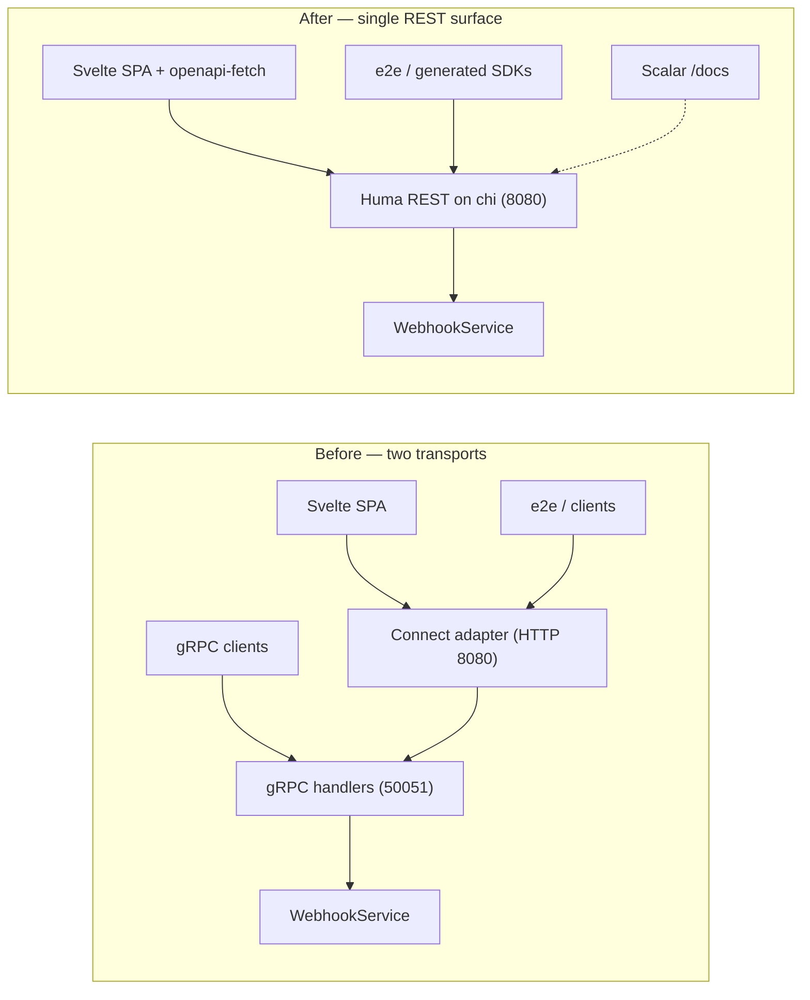

# Feature: Rewamp Sparrow's interface to REST / OpenAPI

## Context

Sparrow today exposes one proto contract (`proto/webhook.proto`, 5 services / ~36 unary RPCs) over
**two** transports that share a single implementation: native gRPC on `:50051` and Connect-RPC
(HTTP/JSON) on `:8080`. This change makes **REST described by OpenAPI the one and only interface**:
drop Connect-RPC, native gRPC, and proto-as-contract; define the API code-first with **Huma v2** on
the existing chi router; expose an idiomatic, versioned REST surface; generate the OpenAPI document
and, from it, client SDKs; serve the interactive reference with **Scalar** from the Go server; and
delete the separate `docs/` Astro site. The business layer (`webhooks.WebhookService`) and all
cross-cutting concerns (API-key auth, security headers, CORS, health, embedded SPA, OTel) are
**preserved** — this is a transport swap, not a behavior change.

Standard operations are modelled as idiomatic REST; operations that cannot be expressed as pure REST
(lifecycle actions, batch jobs) use **Google AIP custom methods** — the `POST …/{id}:verb` colon
form (per the user directive, e.g. `POST /v1/namespaces/{ns}/webhooks/{id}:pause`). Request and
response bodies use **snake_case**.

**Execution order (Huma-generated spec, e2e-driven — per user directive).** Huma code is the
canonical source; the OpenAPI document is **generated by Huma**, not hand-authored. Implementation
proceeds: (1) define the Huma operations + request/response DTOs for **all** endpoints (routes,
schemas, status codes; handlers stubbed) and **export `api/openapi.yaml`** from Huma; (2) generate
the **Python client** from that exported spec; (3) rewire the existing **e2e suite** to that client;
(4) fill in the **handler logic** (wire `webhooks.WebhookService`); (5) the **e2e suite passing** is
the acceptance signal. The design tree below is grouped by deliverable, not execution order. The
committed `api/openapi.yaml` is a generated artifact; a drift check ensures re-exporting from Huma
produces no diff. This implementation runs after the approval gate on a simpler model (Sonnet), per
user directive.

> Note (skill rule #10): the root list has **6** top-level steps. Each maps to a distinct
> deliverable / acceptance criterion; merging any two would force illegal L4 nesting, so the tree is
> kept flat at the root rather than over-nested.

## Design

- 1. Make an OpenAPI contract the single source of truth, generated from Go
  - adopt **Huma v2** over the existing chi router — one operation registration + Go request/response
    types per endpoint generate OpenAPI 3.1; also emit 3.0.x for broad client-generator support
  - `✎` new transport package `internal/rest` — mirrors the protocol-named transport dirs
    (`internal/grpc`, `internal/connect`); holds Huma wiring, REST handlers, and HTTP DTOs
  - `✎` export the contract to `api/openapi.yaml` (+ `api/openapi.json`) — committed artifact,
    drift-guarded by a golden test so generated clients stay reproducible (`api/` is a new dir; proto
    lived in `proto/`)
  - reuse the business service unchanged — `webhooks.WebhookService` is transport-agnostic; REST
    handlers map domain↔DTO and call it, exactly as the gRPC handlers do today
- 2. Expose every capability as idiomatic REST resources (+ AIP custom methods)
  - lay out resources by scope and split the overloaded "event" noun
    - namespace-scoped under `/v1/namespaces/{namespace}/…`: webhooks, subscriptions, deliveries,
      event occurrences, stats; global under `/v1/…`: event-types, template-functions, health-summary
    - `✎` `/v1/event-types` = type definitions (proto `RegisteredEvent`); `/v1/namespaces/{ns}/events`
      = pushed occurrences (proto `EventReport` / event record) — one word, two resources today
    - `⚠` add read-by-id endpoints proto lacked (it exposed list-with-filter only) — idiomatic
      `GET /…/{id}`, backed by existing store getters
  - map each operation to a method
    - standard CRUD → REST verbs: create→`POST` 201, list/read→`GET` 200, partial→`PATCH` 200,
      delete→`DELETE` 204 on `/v1/namespaces/{ns}/…/{id}`
    - `✎` custom/lifecycle actions → Google-AIP colon form: `POST /v1/namespaces/{ns}/webhooks/{id}:pause`
      (also `:resume`, delivery `:retry`, event `:repush`, subscription `:testTemplate`)
    - `⚠` chi + Huma must match a `{id}:verb` colon suffix within one path segment (chi param + static
      tail) — routing spike required early in impl; fallback is `…/{id}/actions/{verb}` if unsupported
  - model batch operations as AIP-style jobs — `POST …/events:rePush` & `…/deliveries:retry` start a
    batch and return a job; `GET …/{repush,retry}-jobs/{id}` polls progress; `…:cancel` aborts;
    wraps the existing prepare-snapshot (`repush_id` / `retry_id`) flow
  - preserve update + payload semantics — `PATCH` omitted = unchanged (mirrors "only non-zero
    `WebhookUpdateFields` applied"), explicit `null` clears a nullable field, setting `events`
    replaces the whole subscription set; bodies are **snake_case**. Concrete per-endpoint WHEN/THEN
    contract lives in the OpenSpec change, not duplicated here
- 3. Serve the reference and generate clients from the contract
  - `✎` serve **Scalar** from the Go server — `/docs` renders Scalar pointed at `/openapi.json`;
    `/openapi.yaml` + `/openapi.json` expose the spec; all three are auth-excluded like `/health`;
    replaces the deleted Astro site
  - regenerate public SDKs from the exported spec — `client/{go,ts,python}` via `openapi-generator`
    (replaces the buf-generated `client/*`, which are gitignored, unconsumed, unpublished)
  - the SPA gets a lean typed client — `openapi-typescript` types + `openapi-fetch`, replacing
    `@connectrpc/connect-web`
  - wire generation into the build — Makefile `generate` runs Huma spec export → `openapi-generator`
    → `openapi-typescript` (replaces `buf generate` + `proto2astro`)
- 4. Rewire the server to a single REST surface, preserving cross-cutting concerns
  - drop the gRPC + Connect transports — remove `grpc.Server`/reflection/otelgrpc, the Connect
    handlers/otelconnect, and `internal/connect`; `:50051` and `SPARROW_GRPC_PORT` are gone
  - mount Huma on the existing chi router behind unchanged middleware — `SecurityHeaders` → CORS →
    `APIKeyAuth.HTTPMiddleware`; `/health`, `/ready` and the embedded SPA
    (`window.__SPARROW_CONFIG__` injection) are untouched
  - keep observability transport-agnostic — `otelhttp` for HTTP tracing replaces
    otelconnect/otelgrpc; the gowrap OTel service wrappers stay as-is
  - translate errors once, centrally — `pkg/errors` categories → HTTP status via one Huma error
    mapper: NotFound→404, AlreadyExists→409, InvalidArgument→400/422, FailedPrecondition→409/412,
    else→500 — replaces the gRPC-status mapping in `internal/grpc/helpers.go`
- 5. Migrate the consumers to REST
  - web SPA — rewrite `web/src/lib/services.ts` to the `openapi-fetch` client (same X-API-Key +
    baseUrl injection); update ~13 route/component files' calls and type imports (from
    `proto/webhook_pb.js` → generated openapi types); drop connect/protobuf deps
  - e2e (Gauge / Python) — rewrite `e2e/libs/sparrow_api.py` to REST paths/verbs; drop `:50051` in
    `sparrow_env.py`; keep all 13 specs incl `09_api_key_auth`; align to snake_case bodies in
    `steps.py`
  - Go integration tests — rewrite `internal/integration/{e2e_test,e2e_retry_test,testhelpers_test}`
    to drive the in-process chi+Huma server over REST; preserve pipeline + retry/batch + auth coverage
  - examples + README — replace `examples/grpc_client.go` with a REST example (curl or generated Go
    client); rewrite README curls from `/webhook.*/…` to REST paths
- 6. Remove the retired machinery cleanly
  - delete the proto toolchain — `proto/*`, `buf.{yaml,gen.yaml,lock}`, protoc-gen-es output, the buf
    `doc` plugin; Dockerfile stops copying the proto ES module
  - delete the docs site — remove the `docs/` Astro project and `.github/workflows/deploy-docs.yml`
  - drop dead dependencies — go.mod: connectrpc.com/connect, otelconnect, google.golang.org/grpc,
    otelgrpc, grpc-web; `web/package.json`: `@connectrpc/*`, `@bufbuild/*`
  - update deploy surfaces — Helm/docker remove `:50051` (ports, networkpolicy, grpcurl NOTES);
    config drops `GRPCPort` and its `Validate()` check

## Diagrams

Transport topology is the structural decision (two shared-impl transports → one REST surface), so a
container-level view earns its place:

## Open Questions

_None — all resolved and folded into the design above (event-types/events split; snake_case bodies;
PATCH omitted=unchanged + null clears + events replaces set; namespace path prefix; Scalar at `/docs`
with `/openapi.{json,yaml}`, auth-excluded)._
