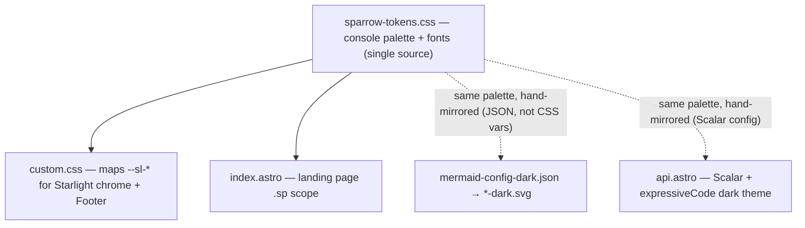

# Feature: Docs theming follows the web "Dispatch Console"

## Context

The web console (`web/src/app.css`, commit `feat(web): redesign console UI as dark "Dispatch
Console"`) is a dark mission-control instrument panel: deep-navy surfaces (`#0b1220` ink, `#121a2a`
panels), **Space Grotesk** display + **Fira Code** mono, a warm **amber beacon** accent (`#f2a93b`),
and functional status colors. The docs site (`docs/`, Astro + Starlight) never followed: it carries
**two** unrelated, mutually-inconsistent themes — a stale "Technical Precision" indigo/cyan token set
(`sparrow-tokens.css`) and a light-first "Paper Notes" serif theme (`custom.css` + the landing page's
own `.sp` overrides, Crimson Pro / Playfair). This change re-skins the docs to the console so the
marketing landing page, the Starlight docs chrome, the diagrams, and the API reference all read as one
product with the app. Pure theming — no content, routing, or build-architecture changes. proto2astro
(legacy gRPC-era doc tooling) is already gone from the build; nothing here reintroduces or depends on
it.

## Design

- Establish one console token set as the single source of truth — kill the three-way theme conflict
  - `✎` rewrite `docs/src/styles/sparrow-tokens.css` to hold the console palette verbatim from `web/src/app.css` — same file name (already documented as "single source of truth"), new values; console surfaces/text/beacon/status + Space Grotesk & Fira Code font stacks, dropping the indigo/cyan Material-3 set
  - load that one file everywhere the docs render — `@import` it at the top of `custom.css` (Starlight pages) so `--sp-*` resolves in chrome + `Footer.astro`, keep the existing `import` in `index.astro` — fixes the latent bug where `Footer.astro`'s `--sp-*` refs currently resolve to nothing on Starlight pages
  - dark-only — no Starlight light/dark toggle; force `color-scheme: dark` (matches the web console) (D1)
- Re-skin the Starlight docs chrome to the console — `custom.css`
  - map Starlight's `--sl-color-*` / `--sl-font*` / `--sl-text-*` onto the console tokens — navy backgrounds, `#e6ecf5` text, amber accent links, Space Grotesk headings + body, Fira Code code; drop every `--paper-*` var and the Crimson/Playfair/Inter font stacks
  - swap the Google Fonts `@import` to Space Grotesk + Fira Code only — remove Crimson Pro / Playfair / Inter
  - retint the console-specific chrome — `html` background to the app's radial amber+green glow over `#0b1220`, sidebar/header/hairlines/scrollbars/selection/blockquote/table/code to console tokens
  - body typeface: Space Grotesk for headings and long-form body, Fira Code for code — exact web match (D2)
- Re-skin the landing page to the console — `index.astro`
  - delete the `.sp` light "paper" overrides (the `--sp-surface`/`--sp-primary`/… block) so the page consumes the console tokens directly instead of re-defining a light theme
  - flip page-level appearance to dark — `color-scheme: dark`, hero mesh + section-muted + terminal + cards recolored via the console tokens they already reference (mostly automatic once tokens change; audit hardcoded warm rgba glows like `rgba(125,79,47,…)` → beacon/green)
  - update the page's own Google Fonts `<link>` to Space Grotesk + Fira Code (drop Crimson/Inter); set display/body font to `--sp-font-*`
- Bring diagrams and the API reference into the console palette
  - retint `mermaid-config-dark.json` to console tokens (bg `#0b1220`/`#121a2a`, lines `#33456a`, text `#e6ecf5`, note/cluster navy) and regenerate the committed `*-dark.svg` via `npm run diagrams`
  - dark-only: `ThemeDiagram` always shows the dark SVG; remove `mermaid-config-light.json` + the `*-light.svg` set (D1)
  - point the API reference at a dark theme — Scalar `ScalarComponent` `theme`/`darkMode`, and set `expressiveCode.themes` to a single dark code theme (drop `github-light`, no light/dark switch)
- Verify the whole docs site renders as the console
  - `cd docs && npm run build` is green — no unresolved token refs, diagrams regenerate, Astro/Starlight build clean
  - browser-drive `astro preview` across the three archetypes — landing `index.astro`, one Starlight guide, `reference/api` — confirm Space Grotesk + Fira Code, `#0b1220` ink, navy panels, amber `#f2a93b` accents, dark-only (no toggle)

## Diagrams

Token flow after the change — one source, three consumers (the decision is *where tokens live*, which
a list flattens):

## Resolved Decisions

All approved at the gate (recommendations accepted):

1. **D1 — dark-only.** No Starlight light/dark toggle; force `color-scheme: dark`. Drop `*-light.svg`
   and `mermaid-config-light.json`; `ThemeDiagram` always renders the dark SVG.
2. **D2 — Space Grotesk body.** Space Grotesk for headings + long-form body, Fira Code for code — an
   exact match to the web console.
3. **D3 — regenerate diagrams** via `npm run diagrams` (mermaid-cli, already wired into
   `diagrams:auto`); no new tooling.
