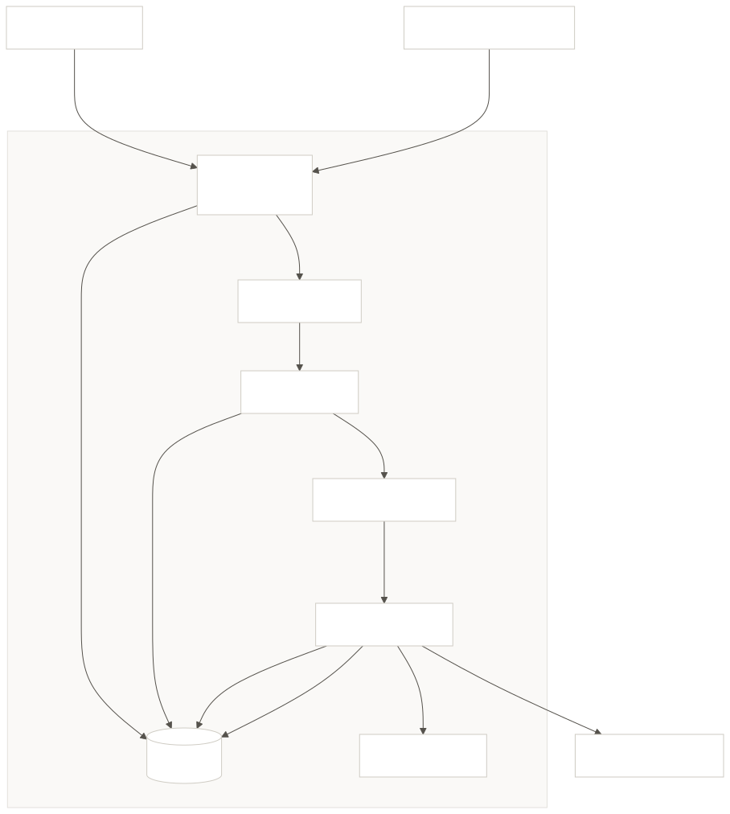

<div align="center">


# Sparrow

**Self-hosted webhook delivery. Retries, signing, health tracking, and a dashboard, with PostgreSQL as the only dependency.**

[](https://github.com/sarathsp06/sparrow/releases)
[](https://github.com/sarathsp06/sparrow/actions/workflows/ci.yml)
[](https://go.dev)
[](https://github.com/sarathsp06/sparrow/pkgs/container/sparrow)
[](https://sarathsp06.github.io/sparrow/)
[](LICENSE)

[Quick start](#quick-start) · [What you get](#what-you-get) · [Satellites](#satellites) · [Documentation](#documentation) · [Contributing](#contributing)

</div>

Sparrow sends your webhooks so you don't have to build the boring, hard parts: async fan-out, retries with backoff, Standard Webhooks signatures, per-endpoint health, full delivery history, and a consumer portal where your customers manage their own endpoints.

It is one Go binary with an embedded Svelte dashboard. No Redis, no broker, no sidecar workers. PostgreSQL holds the data and, through [River](https://riverqueue.com), the job queue too. Payloads never leave your network.

```text
your services ──▶ Sparrow API + dashboard ──▶ PostgreSQL + River ──▶ signed deliveries to subscribers
```

## Quick start

**Run it** with Docker Compose. No clone, no secrets, ready for local evaluation:

```bash
curl -O https://raw.githubusercontent.com/sarathsp06/sparrow/main/deploy/docker-compose.yml
docker compose up -d
```

Open <http://localhost:8080> for the dashboard and <http://localhost:8080/docs> for the interactive API reference. `docker compose down -v` cleans up.

**Send your first webhook** with the CLI. Install it in one line (macOS and Linux; it verifies the release checksum, and re-running it updates in place):

```bash
curl -fsSL https://raw.githubusercontent.com/sarathsp06/sparrow/main/scripts/install.sh | sh
```

Then, in two terminals:

```bash
sparrow init --url http://localhost:8080        # point the CLI at your server
sparrow listen --event order.created            # receive deliveries right here (Ctrl-C cleans up)
```

```bash
sparrow push order.created -d '{"order_id":"ord_1","amount":42}'
```

The delivery shows up in the first terminal, signature verified. Routing that event to Slack is one more command:

```bash
sparrow use slack --param webhook_url=https://hooks.slack.com/services/T00/B00/xxx --event order.created
```

Prefer curl or an SDK? Follow the [Quickstart](https://sarathsp06.github.io/sparrow/getting-started/quickstart/). Deploying for real? Start at [Production Deployment](https://sarathsp06.github.io/sparrow/deployment/production/): the Compose file above is an open, local-only setup on purpose.

## What you get

- **Reliable delivery**: at-least-once, retries with backoff, per-webhook rate limits, 429-aware snoozing, and deterministic bulk re-push and retry.
- **Signed and encrypted**: HMAC-SHA256 and optional Ed25519 signatures in [Standard Webhooks](https://www.standardwebhooks.com/) format; secrets and sensitive headers envelope-encrypted at rest; SSRF protection on every outbound request.
- **Operable**: healthy / degraded / unhealthy per endpoint, automatic pausing of receivers that keep failing, full request and response history, OpenTelemetry traces, metrics, and logs.
- **Shaped for the receiver**: per-subscription Go templates reshape payloads; shipped recipes turn an event into a Slack, Discord, PagerDuty, ntfy, ClickHouse, Twilio, SendGrid, or CloudEvents call with no glue service.
- **Safe to evolve**: versioned event types, soft schema validation that warns instead of dropping, and export/import of definitions between environments.
- **Self-service for your customers**: an embeddable, token-scoped portal where each consumer registers endpoints and inspects and retries their own deliveries.
- **One API, documented**: OpenAPI 3.1 generated from the Go handlers, served interactively at `/docs`, committed at [`api/openapi.yaml`](api/openapi.yaml).

Curious how it fits together? Read [How it works](https://sarathsp06.github.io/sparrow/getting-started/how-it-works/), or explore the [interactive architecture diagram](https://sarathsp06.github.io/sparrow/diagrams/sparrow-layered-architecture.html).

<p align="center">
  <a href="https://sarathsp06.github.io/sparrow/diagrams/sparrow-layered-architecture.html">
    <picture>
      <source media="(prefers-color-scheme: dark)" srcset="./docs/src/assets/diagrams/system-overview-dark.svg">
      <source media="(prefers-color-scheme: light)" srcset="./docs/src/assets/diagrams/system-overview-light.svg">
      
    </picture>
  </a>
</p>

## Satellites

Companion tools that use Sparrow through its public API and never reach inside it. All optional, all in [`satellites/`](satellites/).

| Satellite | What it does |
|-----------|--------------|
| [CLI](https://sarathsp06.github.io/sparrow/satellites/cli/) | Push events, tail deliveries, receive webhooks locally, apply recipes, and debug templates from the terminal. |
| [Recipes](https://sarathsp06.github.io/sparrow/satellites/recipes/) | Destination adapters as YAML: a URL plus a transform, applied with `sparrow use <name>`. |
| [Sources](https://sarathsp06.github.io/sparrow/satellites/sources/) | Bring events in: a cron emitter and Stripe and GitHub receivers that verify and re-publish. |
| [Sinks](https://sarathsp06.github.io/sparrow/satellites/sinks/) | Send deliveries beyond HTTP: SMTP email, S3-compatible archiving, and OTLP log export. |

## Documentation

Everything deeper lives on the docs site: <https://sarathsp06.github.io/sparrow/>

- [Why Sparrow](https://sarathsp06.github.io/sparrow/getting-started/why-sparrow/) and the [note for decision makers](https://sarathsp06.github.io/sparrow/getting-started/for-decision-makers/)
- [Installation](https://sarathsp06.github.io/sparrow/getting-started/installation/) and [Configuration](https://sarathsp06.github.io/sparrow/getting-started/configuration/), every environment variable in one place
- Guides: [verifying signatures](https://sarathsp06.github.io/sparrow/guides/verify-signatures/) in nine languages, [payload transformation](https://sarathsp06.github.io/sparrow/guides/payload-transformation/), [event type versioning](https://sarathsp06.github.io/sparrow/guides/event-type-versioning/), [health alerts](https://sarathsp06.github.io/sparrow/guides/webhook-health-alerts/), [embedding the portal](https://sarathsp06.github.io/sparrow/guides/portal-embedding/)
- Deployment: [production](https://sarathsp06.github.io/sparrow/deployment/production/), [access tokens and invites](https://sarathsp06.github.io/sparrow/deployment/access/), [securing Sparrow](https://sarathsp06.github.io/sparrow/deployment/security/)
- Reference: [architecture](https://sarathsp06.github.io/sparrow/reference/architecture/), [API reference](https://sarathsp06.github.io/sparrow/reference/api/), [client libraries](https://sarathsp06.github.io/sparrow/reference/client-libraries/), [template functions](https://sarathsp06.github.io/sparrow/reference/template-functions/)

The Docker image is at [`ghcr.io/sarathsp06/sparrow`](https://github.com/sarathsp06/sparrow/pkgs/container/sparrow), prebuilt binaries on the [releases page](https://github.com/sarathsp06/sparrow/releases).

## Contributing

```bash
git clone https://github.com/sarathsp06/sparrow.git && cd sparrow
make dev-db          # throwaway Postgres on localhost:5432
make run             # server on :8080, migrations run on startup
make test            # all modules
```

`make help` lists every target, [CONTRIBUTING.md](CONTRIBUTING.md) has the workflow, and [AGENTS.md](AGENTS.md) the architecture notes and conventions.

## License

[MIT](LICENSE)
