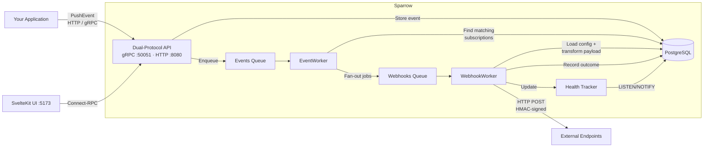
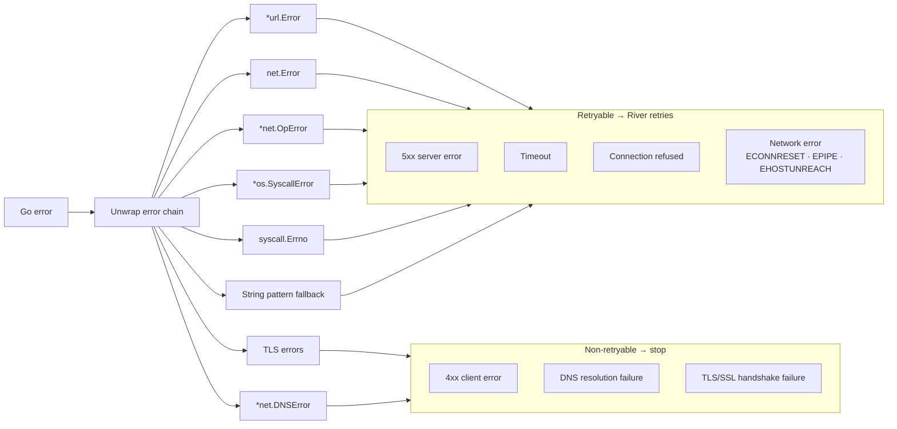
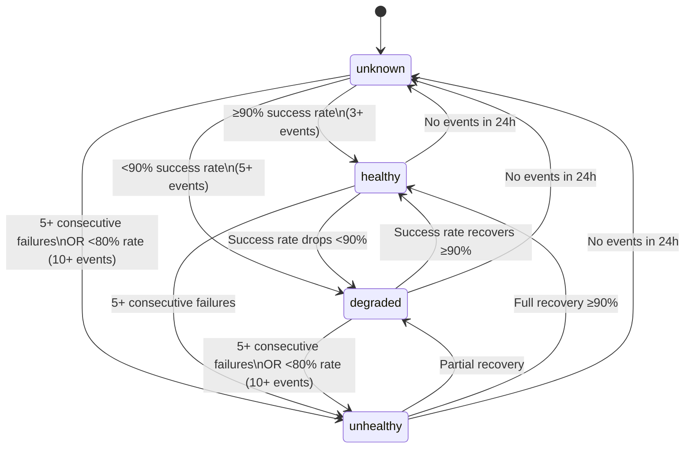
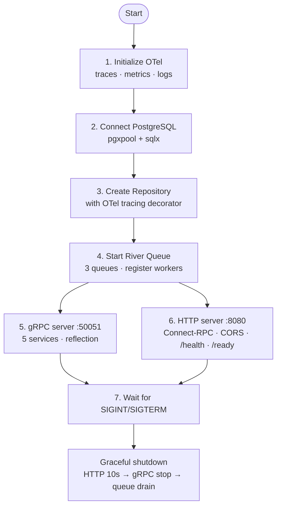

# Sparrow - Technical Architecture

## What Is Sparrow?

Sparrow is an event-driven webhook delivery platform. It sits between your application and external HTTP endpoints, providing reliable, observable webhook delivery with retries, health tracking, and payload transformation.

**Problem it solves:** When your app needs to notify external systems (e.g., "user created", "order completed"), direct HTTP calls are fragile. Sparrow acts as a reliable intermediary that guarantees delivery, retries on failure, and provides full audit trails.

---

## Architecture Overview



## Tech Stack

| Layer | Technology |
|-------|-----------|
| Backend | Go 1.25 |
| Database | PostgreSQL 15 |
| Job Queue | River (Postgres-based) |
| API | gRPC (`:50051`) + Connect-RPC/HTTP (`:8080`) |
| Protobuf | buf.build toolchain |
| Web UI | SvelteKit 5 + TypeScript + Tailwind CSS 4 |
| Observability | OpenTelemetry (traces, metrics, logs via OTLP) |
| DB Access | pgx/v5 + sqlx (OTel-instrumented) |
| CI | GitHub Actions |
| Container | Multi-stage Dockerfile (distroless nonroot) |

---

## Dual-Protocol API

The same gRPC service implementations back both protocols -- no code duplication:

- **gRPC** on `:50051` for high-performance programmatic access
- **Connect-RPC (HTTP/JSON)** on `:8080` for curl, browsers, and any HTTP client

Five domain services: `WebhookService`, `EventService`, `SubscriptionService`, `DeliveryService`, `HealthService`.

Connect-RPC URL pattern: `POST http://localhost:8080/webhook.{Service}/{Method}`

---

## Error Classification & Retry Logic

The `pkg/errors/` package implements a taxonomy-based error classifier that inspects Go errors to determine retryability:



Non-retryable errors return `nil` to River (stopping retries); retryable errors return an `error` to trigger River's built-in retry mechanism.

---

## Health State Machine

Event-sourced health calculation with a 24-hour lookback window:



**How it works:**
1. Each delivery outcome is recorded as a health event
2. Health state is atomically upserted (tracks consecutive failures, last success/failure timestamps)
3. Webhook health status is recalculated and persisted
4. Hourly aggregation computes per-webhook summaries (p95 response time, error category breakdown)

**Real-time reactivity:** PostgreSQL `LISTEN/NOTIFY` pushes health events for async processing.

---

## HTTP Client Design

A centralized, OTel-instrumented HTTP client (`internal/webhooks/client/`):

- **Connection pooling**: 100 max idle connections, 10 per host, 90s idle timeout
- **HMAC signing**: `X-Sparrow-Signature-256` header using `HMAC-SHA256(timestamp + "." + payload, secret)` (Stripe/GitHub pattern)
- **Template engine**: Go `text/template` with LRU cache (100 entries, SHA-256 keyed), ~20 built-in helper functions (json, base64, urlencode, string manipulation, etc.)
- **Object pooling**: `sync.Pool` for `bytes.Buffer`, `[]byte` slices, and header maps to reduce GC pressure
- **Header merging**: Subscription-level headers override webhook-level defaults
- **In-process metrics**: Lock-free atomic counters for request totals, error categories, cache hit rates, and response time statistics

---

## Observability

Full OpenTelemetry stack with OTLP export:

**Three pillars:**
- **Traces**: OTLP HTTP exporter, configurable sampler (ratio/always/never), batch processor
- **Metrics**: OTLP HTTP periodic reader (default 30s export interval)
- **Logs**: OTLP HTTP exporter with batch processor, bridged to Go `slog`

**Custom application metrics:**

| Metric | Type |
|--------|------|
| `sparrow_webhook_registrations_total` | Counter |
| `sparrow_events_pushed_total` | Counter |
| `sparrow_webhook_deliveries_total` | Counter |
| `sparrow_webhook_delivery_duration_seconds` | Histogram |
| `sparrow_queue_depth` | UpDownCounter |
| `sparrow_active_webhooks` | UpDownCounter |

**Instrumented layers:** HTTP transport (`otelhttp`), gRPC server (`otelgrpc`), Connect-RPC (`otelconnect`), job queue inserter (generated via `gowrap`), webhook delivery worker, and all repository calls.

---

## Server Boot Sequence



---

## Configuration

| Variable | Default | Description |
|----------|---------|-------------|
| `DATABASE_URL` | `postgres://localhost/riverqueue?sslmode=disable` | PostgreSQL connection |
| `HTTP_PORT` | `8080` | Connect-RPC HTTP port |
| `GRPC_PORT` | `50051` | gRPC port |
| `OTEL_EXPORTER_OTLP_ENDPOINT` | `localhost:4317` | OpenTelemetry collector |
| `ENVIRONMENT` | `development` | Environment name for OTel resource |
| `PUBLIC_API_URL` | `http://localhost:8080` | API URL for web UI |

## Quick Start

```bash
make docker-dev     # PostgreSQL + River UI + OpenTelemetry Collector
make migrate        # Run database migrations
make run            # Go server (gRPC :50051, HTTP :8080)
make run-web        # SvelteKit UI (:5173)
make example        # Run example gRPC client
```
