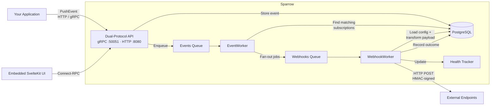
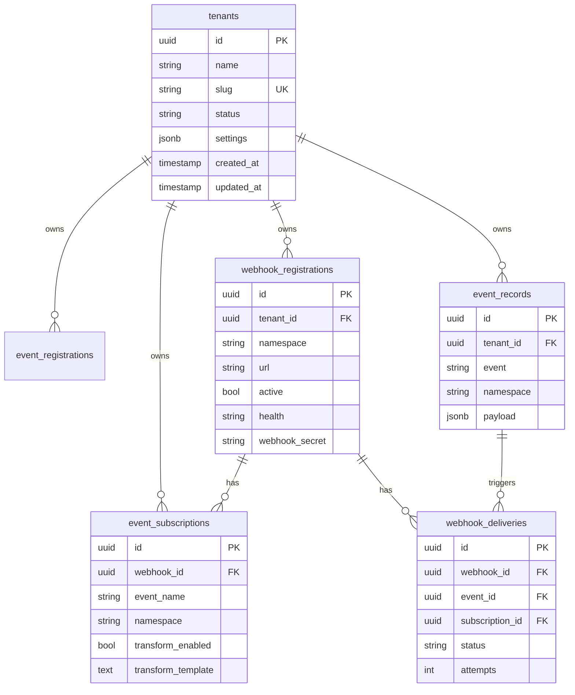
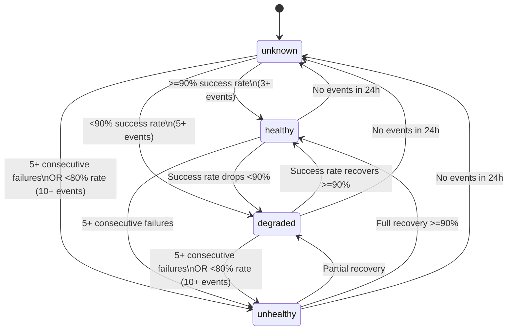

# Sparrow -- Technical Reference

This document covers Sparrow's internal architecture and design details. For configuration and deployment, see [CONFIGURATION.md](CONFIGURATION.md). For quick start, see [README.md](README.md).

---

## Table of Contents

- [Architecture Overview](#architecture-overview)
- [Data Model](#data-model)
- [Event Processing Pipeline](#event-processing-pipeline)
- [Error Classification & Retry Logic](#error-classification--retry-logic)
- [Health State Machine](#health-state-machine)
- [HTTP Client Design](#http-client-design)
- [Web UI Architecture](#web-ui-architecture)

---

## Architecture Overview



### Tech Stack

- **Backend** -- Go 1.25
- **Database** -- PostgreSQL 15
- **Job Queue** -- River (Postgres-based)
- **API** -- gRPC (`:50051`) + Connect-RPC/HTTP (`:8080`)
- **Protobuf** -- buf.build toolchain
- **Web UI** -- SvelteKit 5 + TypeScript + Tailwind CSS 4 (embedded static build)
- **Observability** -- OpenTelemetry (traces, metrics, logs via OTLP)
- **DB Access** -- pgx/v5 + sqlx (OTel-instrumented)
- **Container** -- Multi-stage Dockerfile (distroless nonroot)

### Dual-Protocol API

The same gRPC service implementations back both protocols -- no code duplication:

- **gRPC** on `:50051` for high-performance programmatic access
- **Connect-RPC (HTTP/JSON)** on `:8080` for curl, browsers, and any HTTP client

Six services: `WebhookService`, `EventService`, `SubscriptionService`, `DeliveryService`, `HealthService`, `NamespaceService`.

---

## Data Model



### Tenant Isolation

Every domain table has a `tenant_id` column with a foreign key to `tenants`. All queries are scoped by tenant ID. A default tenant (`00000000-0000-0000-0000-000000000001`) is auto-created on first boot.

---

## Event Processing Pipeline

```
PushEvent RPC
    │
    v
EventService.PushEvent()
    │  1. Validate payload against registered event schema
    │  2. Insert event_record
    │  3. Enqueue EventArgs job (River, "events" queue)
    v
EventProcessingWorker.Work()
    │  1. Load event from DB
    │  2. Query matching subscriptions (tenant_id + namespace + event_name)
    │  3. For each subscription: apply Go template transform (if enabled)
    │  4. Batch-insert all webhook_delivery records (single multi-row INSERT)
    │  5. Batch-enqueue all WebhookArgs jobs (River InsertMany)
    v
WebhookWorker.Work()
    │  1. Load delivery from DB
    │  2. HTTP POST to webhook URL (with headers, HMAC, timeout)
    │  3. Record delivery_attempt
    │  4. Update delivery status (success/failed/retrying)
    │  5. Update webhook_health_events + webhook_health_state
    │  6. If failed + retries remaining: re-enqueue with backoff
    v
Target URL receives webhook payload
```

---

## Error Classification & Retry Logic

The `pkg/errors/` package implements a taxonomy-based error classifier that inspects Go errors to determine retryability:


Non-retryable errors return `nil` to River (stopping retries); retryable errors return an `error` to trigger River's built-in retry mechanism.

---

## Health State Machine

Event-sourced health calculation with a 24-hour lookback window:



**How it works:**
1. Each delivery outcome is recorded as a health event
2. Health state is atomically upserted (tracks consecutive failures, last success/failure timestamps)
3. Webhook health status is recalculated and persisted
4. Hourly aggregation computes per-webhook summaries (p95 response time, error category breakdown)

---

## HTTP Client Design

A centralized, OTel-instrumented HTTP client (`internal/webhooks/client/`):

- **Connection pooling**: 100 max idle connections, 10 per host, 90s idle timeout
- **HMAC signing**: `X-Sparrow-Signature-256` header using `HMAC-SHA256(timestamp + "." + body, secret)` (Stripe/GitHub pattern)
- **Template engine**: Go `text/template` with LRU cache (100 entries, SHA-256 keyed), ~20 built-in helper functions (json, base64, urlencode, string manipulation, etc.)
- **Object pooling**: `sync.Pool` for `bytes.Buffer`, `[]byte` slices, and header maps to reduce GC pressure
- **Header merging**: Subscription-level headers override webhook-level defaults
- **In-process metrics**: Lock-free atomic counters for request totals, error categories, cache hit rates, and response time statistics

### Default Webhook Body

Every webhook delivery sends a JSON envelope with snake_case field names:

```json
{
  "version": "1",
  "event_id": "550e8400-e29b-41d4-a716-446655440000",
  "event_name": "user.created",
  "namespace": "billing",
  "webhook_id": "7c9e6679-7425-40de-944b-e07fc1f90ae7",
  "delivery_id": "d-123",
  "timestamp": "2026-03-17T10:30:00Z",
  "attempt": 1,
  "payload": {
    "user_id": "u-123",
    "email": "alice@example.com"
  }
}
```

- `version` -- Envelope schema version (currently `"1"`).
- `event_id` -- UUID of the event that triggered this delivery.
- `event_name` -- The event type (e.g. `user.created`, `order.paid`).
- `namespace` -- Namespace the event belongs to.
- `webhook_id` -- UUID of the webhook registration receiving this delivery.
- `delivery_id` -- UUID of this specific delivery attempt.
- `timestamp` -- ISO 8601 / RFC 3339 timestamp of when the delivery was sent.
- `attempt` -- Delivery attempt number (1 = first attempt, 2+ = retries).
- `payload` -- The original event payload as submitted by the producer.

When a subscription has `transform_enabled = true` and a `transform_template`, the template output replaces the entire body.

### HTTP Headers

Every webhook delivery includes these headers:

- `Content-Type: application/json`
- `User-Agent: Sparrow-Webhook/0.1.2`
- `X-Sparrow-Event-ID` -- Same as `event_id` in the body.
- `X-Sparrow-Delivery-ID` -- Same as `delivery_id` in the body.
- `X-Sparrow-Webhook-ID` -- Same as `webhook_id` in the body.
- `X-Sparrow-Signature-256` -- HMAC-SHA256 signature (only when `webhook_secret` is set).
- `X-Sparrow-Timestamp` -- Unix epoch seconds used in signature (only when `webhook_secret` is set).

Custom headers configured on the webhook or subscription are merged in, with subscription-level headers overriding webhook-level defaults.

### Verifying Webhook Signatures

When a `webhook_secret` is configured, Sparrow signs every delivery so the consumer can verify authenticity.

**Signature scheme:**

1. Sparrow sets two headers: `X-Sparrow-Timestamp` (Unix epoch seconds) and `X-Sparrow-Signature-256` (prefixed with `sha256=`).
2. The signed message is: `<timestamp>.<raw_request_body>`.
3. The HMAC is computed with SHA-256 using the `webhook_secret` as the key.
4. The result is hex-encoded and prefixed with `sha256=`.

**Verification steps:**

1. Read the raw request body bytes (before any JSON parsing).
2. Extract the `X-Sparrow-Timestamp` and `X-Sparrow-Signature-256` headers.
3. **Reject stale timestamps.** If the difference exceeds your tolerance (e.g. 5 minutes), reject the request.
4. Reconstruct the signed message: `timestamp + "." + raw_body`.
5. Compute `HMAC-SHA256(message, webhook_secret)` and hex-encode the result.
6. **Use constant-time comparison** to compare your computed signature against the value after the `sha256=` prefix.

**Example: Go**

```go
import (
    "crypto/hmac"
    "crypto/sha256"
    "crypto/subtle"
    "encoding/hex"
    "fmt"
    "io"
    "math"
    "net/http"
    "strconv"
    "time"
)

func VerifyWebhook(r *http.Request, secret string) error {
    body, err := io.ReadAll(r.Body)
    if err != nil {
        return fmt.Errorf("failed to read body: %w", err)
    }

    timestamp := r.Header.Get("X-Sparrow-Timestamp")
    signature := r.Header.Get("X-Sparrow-Signature-256")
    if timestamp == "" || signature == "" {
        return fmt.Errorf("missing signature headers")
    }

    ts, err := strconv.ParseInt(timestamp, 10, 64)
    if err != nil {
        return fmt.Errorf("invalid timestamp: %w", err)
    }
    if math.Abs(float64(time.Now().Unix()-ts)) > 300 {
        return fmt.Errorf("timestamp too old, possible replay attack")
    }

    message := timestamp + "." + string(body)
    mac := hmac.New(sha256.New, []byte(secret))
    mac.Write([]byte(message))
    expected := "sha256=" + hex.EncodeToString(mac.Sum(nil))

    if subtle.ConstantTimeCompare([]byte(expected), []byte(signature)) != 1 {
        return fmt.Errorf("signature mismatch")
    }
    return nil
}
```

**Example: Node.js**

```javascript
const crypto = require("crypto");

function verifyWebhook(rawBody, timestamp, signature, secret) {
  const age = Math.abs(Date.now() / 1000 - parseInt(timestamp, 10));
  if (age > 300) throw new Error("Timestamp too old");

  const message = `${timestamp}.${rawBody}`;
  const expected =
    "sha256=" +
    crypto.createHmac("sha256", secret).update(message).digest("hex");

  if (!crypto.timingSafeEqual(Buffer.from(expected), Buffer.from(signature))) {
    throw new Error("Signature mismatch");
  }
}
```

**Example: Python**

```python
import hashlib, hmac, time

def verify_webhook(raw_body: bytes, timestamp: str, signature: str, secret: str):
    if abs(time.time() - int(timestamp)) > 300:
        raise ValueError("Timestamp too old")

    message = f"{timestamp}.{raw_body.decode()}"
    expected = "sha256=" + hmac.new(
        secret.encode(), message.encode(), hashlib.sha256
    ).hexdigest()

    if not hmac.compare_digest(expected, signature):
        raise ValueError("Signature mismatch")
```

---

## Web UI Architecture

The web dashboard is a SvelteKit application that compiles to static files and is embedded into the Go binary via `go:embed`. See [web/README.md](web/README.md) for development setup.

**Build pipeline:**
1. `cd web && npm run build` -- compiles SvelteKit to static files in `internal/ui/dist/`
2. `go build ./cmd/server` -- embeds `internal/ui/dist/` via `go:embed`
3. At runtime, `internal/ui/embed.go` serves the SPA with proper fallback routing

The Docker image builds the frontend automatically -- no manual build step needed.
