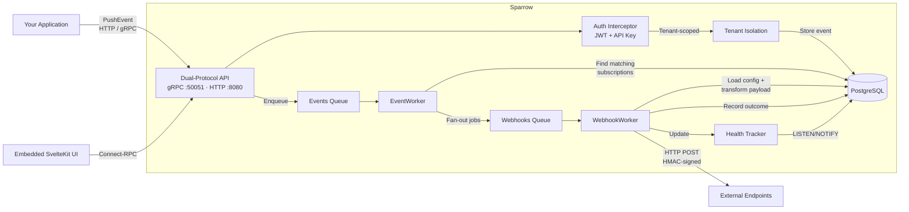
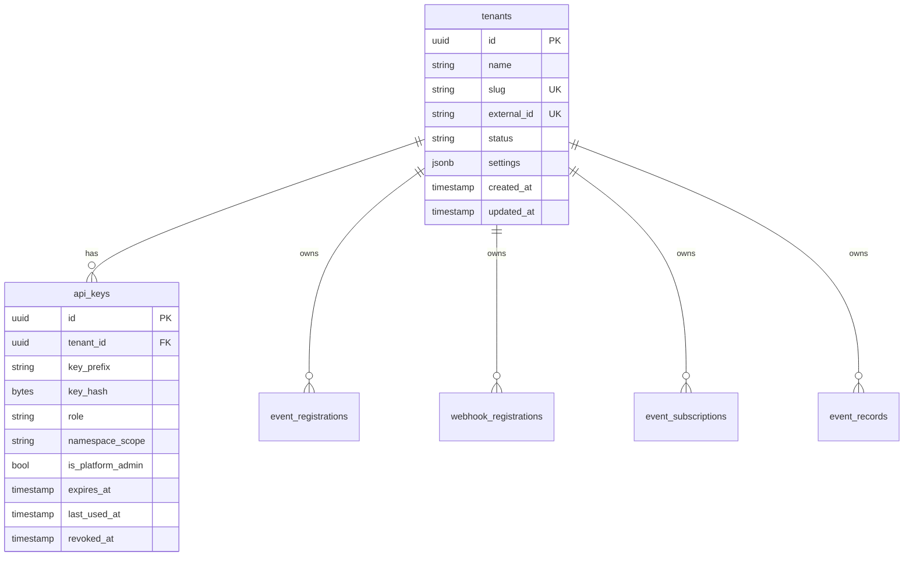
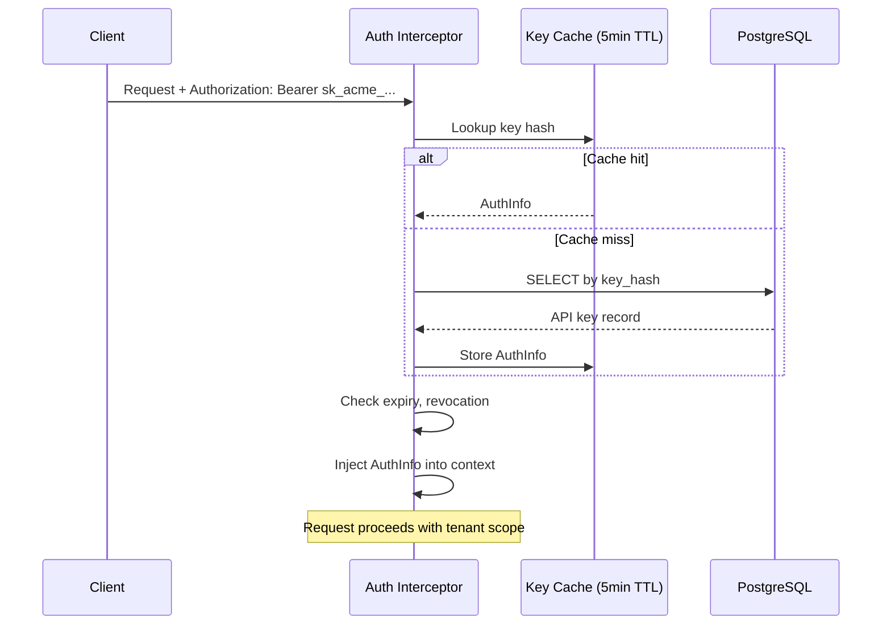
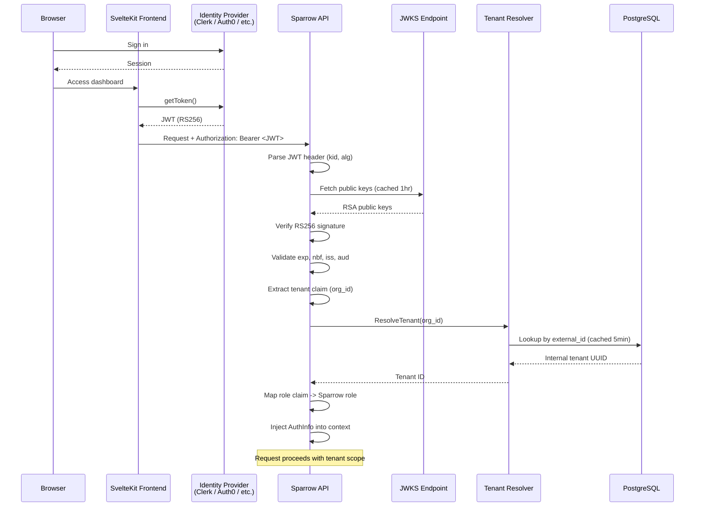
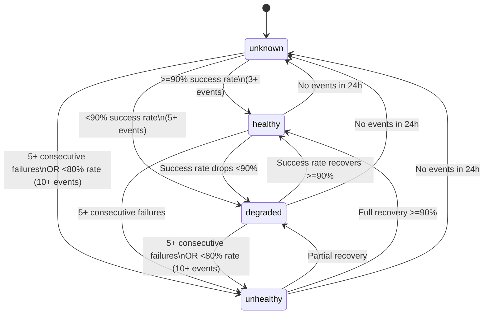
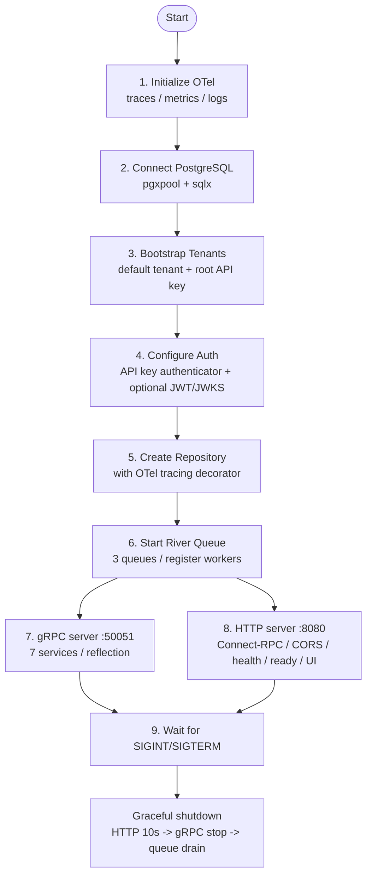

# Sparrow - Technical Architecture

This document covers Sparrow's internal architecture. For setup, usage, and configuration, see [README.md](README.md).

---

## Architecture Overview



## Tech Stack

| Layer | Technology |
|-------|-----------|
| Backend | Go 1.25 |
| Database | PostgreSQL 15 |
| Job Queue | River (Postgres-based) |
| API | gRPC (`:50051`) + Connect-RPC/HTTP (`:8080`) |
| Protobuf | buf.build toolchain |
| Web UI | SvelteKit 5 + TypeScript + Tailwind CSS 4 (embedded static build) |
| Observability | OpenTelemetry (traces, metrics, logs via OTLP) |
| DB Access | pgx/v5 + sqlx (OTel-instrumented) |
| CI | GitHub Actions |
| Container | Multi-stage Dockerfile (distroless nonroot) |

---

## Dual-Protocol API

The same gRPC service implementations back both protocols -- no code duplication:

- **gRPC** on `:50051` for high-performance programmatic access
- **Connect-RPC (HTTP/JSON)** on `:8080` for curl, browsers, and any HTTP client

Seven domain services: `WebhookService`, `EventService`, `SubscriptionService`, `DeliveryService`, `HealthService`, `TenantService`, `APIKeyService`.

---

## Data Model



### Tenant Isolation

Every domain table (`event_registrations`, `webhook_registrations`, `event_subscriptions`, `event_records`) has a `tenant_id` column with a foreign key to `tenants`. All queries are scoped by tenant ID, extracted from the authenticated context (API key or JWT).

- **External ID mapping:** Tenants can have an `external_id` that maps to an identity provider's organization ID (e.g., Clerk `org_id`). JWT-authenticated requests are scoped to the correct tenant via this mapping.
- **Default tenant:** Auto-created on first boot with UUID `00000000-0000-0000-0000-000000000001`
- **Tenant slugs:** URL-safe identifiers derived from tenant name (e.g., "Acme Corp" -> "acme-corp")
- **Tenant settings:** JSONB column for per-tenant configuration

### Bootstrap Sequence

On startup, the bootstrap process:

1. Ensures the default tenant exists (creates if missing)
2. Generates a root API key with `tenant:admin` + `is_platform_admin` (if no keys exist)
3. Prints the root API key to stdout on first boot
4. Supports `SPARROW_ROOT_API_KEY` env var for deterministic key generation

---

## Auth Architecture

Sparrow's auth system supports two authenticator types (API key and JWT) via a common `Authenticator` interface. The interceptor tries each registered authenticator in order -- the first one to succeed determines the identity.

### Interceptor Chain

Auth is implemented as dual interceptors (gRPC unary + Connect-RPC) that:

1. Extract the bearer token from `Authorization` header
2. Try each registered authenticator in order (JWT first, then API key)
3. The first authenticator that succeeds determines the identity
4. If all authenticators fail, the request is rejected
5. Build `AuthInfo` (TenantID, roles, permissions) and inject into request context
6. Downstream service methods call `auth.MustFromContext(ctx)` to get the tenant ID

Certain procedures (e.g., health checks) are skipped from auth via a configurable allowlist.

### API Key Authenticator

Uses SHA-256 hashing with an in-memory cache (5-minute TTL) for performance.



### JWT Authenticator

Provider-agnostic RS256 JWT verification. No external JWT library -- verification is implemented with Go's `crypto/rsa` stdlib.



**Key components:**

| Component | File | Purpose |
|-----------|------|---------|
| `JWKSProvider` | `internal/auth/jwks.go` | Fetches and caches RSA public keys from a JWKS URL |
| `JWTAuthenticator` | `internal/auth/jwt.go` | Validates JWT signature and claims, maps to AuthInfo |
| `CachingTenantResolver` | `internal/auth/tenant_resolver.go` | Maps external org IDs to internal tenant UUIDs with caching |
| `JWTClaimsConfig` | `internal/auth/jwt.go` | Configurable claim names, role mapping, issuer/audience |

### RBAC Model

The authorization system defines 5 roles and 25 permissions. `auth.Authorize(authInfo, permission)` checks whether the authenticated identity has a specific permission. See the [RBAC Roles table in README.md](README.md#rbac-roles) for the full role/scope breakdown.

Platform admin keys (`is_platform_admin: true`) bypass tenant scoping entirely, allowing cross-tenant management operations.

---

## Error Classification & Retry Logic

The `pkg/errors/` package implements a taxonomy-based error classifier that inspects Go errors to determine retryability:


Non-retryable errors return `nil` to River (stopping retries); retryable errors return an `error` to trigger River's built-in retry mechanism.

---

## Health State Machine

Event-sourced health calculation with a 24-hour lookback window:



**How it works:**
1. Each delivery outcome is recorded as a health event
2. Health state is atomically upserted (tracks consecutive failures, last success/failure timestamps)
3. Webhook health status is recalculated and persisted
4. Hourly aggregation computes per-webhook summaries (p95 response time, error category breakdown)

**Real-time reactivity:** PostgreSQL `LISTEN/NOTIFY` pushes health events for async processing.

---

## HTTP Client Design

A centralized, OTel-instrumented HTTP client (`internal/webhooks/client/`):

- **Connection pooling**: 100 max idle connections, 10 per host, 90s idle timeout
- **HMAC signing**: `X-Sparrow-Signature-256` header using `HMAC-SHA256(timestamp + "." + payload, secret)` (Stripe/GitHub pattern)
- **Template engine**: Go `text/template` with LRU cache (100 entries, SHA-256 keyed), ~20 built-in helper functions (json, base64, urlencode, string manipulation, etc.)
- **Object pooling**: `sync.Pool` for `bytes.Buffer`, `[]byte` slices, and header maps to reduce GC pressure
- **Header merging**: Subscription-level headers override webhook-level defaults
- **In-process metrics**: Lock-free atomic counters for request totals, error categories, cache hit rates, and response time statistics

---

## Observability

Full OpenTelemetry stack with OTLP export:

**Three pillars:**
- **Traces**: OTLP HTTP exporter, configurable sampler (ratio/always/never), batch processor
- **Metrics**: OTLP HTTP periodic reader (default 30s export interval)
- **Logs**: OTLP HTTP exporter with batch processor, bridged to Go `slog`

**Custom application metrics:**

| Metric | Type |
|--------|------|
| `sparrow_webhook_registrations_total` | Counter |
| `sparrow_events_pushed_total` | Counter |
| `sparrow_webhook_deliveries_total` | Counter |
| `sparrow_webhook_delivery_duration_seconds` | Histogram |
| `sparrow_queue_depth` | UpDownCounter |
| `sparrow_active_webhooks` | UpDownCounter |

**Instrumented layers:** HTTP transport (`otelhttp`), gRPC server (`otelgrpc`), Connect-RPC (`otelconnect`), job queue inserter (generated via `gowrap`), webhook delivery worker, and all repository calls.

---

## Server Boot Sequence



---

## Web UI Architecture

The web dashboard is a SvelteKit application that compiles to static files and is embedded into the Go binary via `go:embed`. See [web/README.md](web/README.md) for development setup.

**Build pipeline:**
1. `cd web && npm run build` -- compiles SvelteKit to static files in `internal/ui/dist/`
2. `go build ./cmd/server` -- embeds `internal/ui/dist/` via `go:embed`
3. At runtime, `internal/ui/embed.go` serves the SPA with proper fallback routing

### Pluggable Auth Providers

The frontend uses a pluggable auth provider system. See [README.md](README.md#web-ui-authentication-pluggable-providers) for usage and setup instructions.

**Component dispatch:**

```
+layout.svelte  ->  AuthShell.svelte  ->  ClerkAuthShell.svelte  (or)
                                      ->  NoAuthShell.svelte
                                      ->  (your custom provider)
```

Each auth shell implements a snippet contract (`header`, `children`), controls when page content renders, and calls `registerTokenProvider()` to inject JWTs into API requests. The services layer (`services.ts`) only calls `getSessionToken()` -- it never imports any provider SDK.

**Key files:**

| File | Purpose |
|------|---------|
| `web/src/lib/auth.ts` | Provider-agnostic token abstraction |
| `web/src/lib/auth/types.ts` | `AuthProviderType` and `AuthProviderConfig` types |
| `web/src/lib/auth/provider.ts` | Detects active provider from env vars |
| `web/src/lib/auth/AuthShell.svelte` | Dispatches to the correct provider shell |
| `web/src/lib/auth/providers/clerk/` | Clerk-specific shell + bridge |
| `web/src/lib/auth/providers/none/` | No-auth fallback shell |
| `web/src/lib/services.ts` | Connect-RPC transport with Bearer token interceptor |
