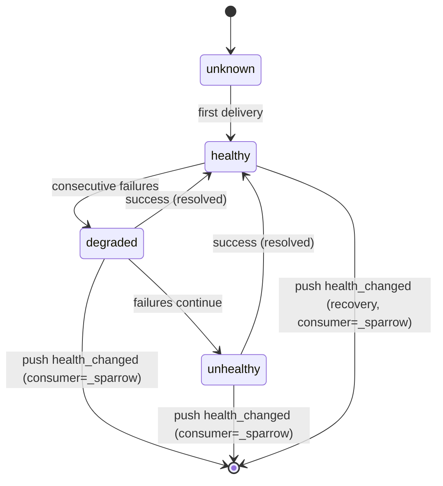
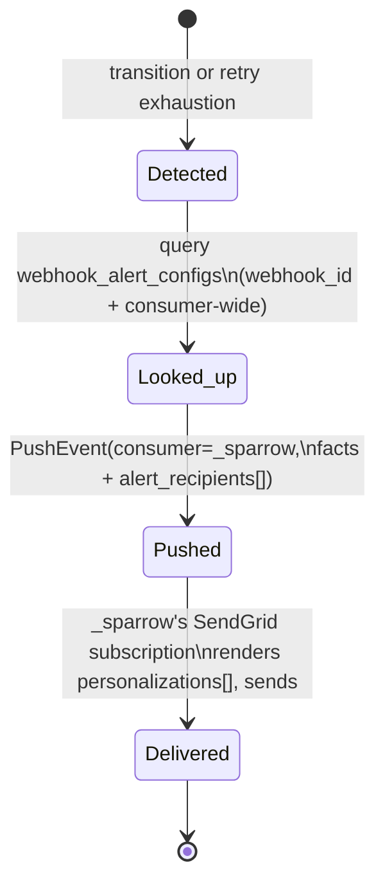

# Feature: Webhook health/delivery-failure email alerts

## Context

Right now, when a registered webhook starts failing (frequent 4xx/5xx, retries exhausting, health
degrading to `unhealthy`), nobody is told — someone has to notice it in the UI. The goal: let a
tenant opt a webhook (or all of their webhooks) into an email alert, using Sparrow's own
event/subscription pipeline internally rather than a bolted-on side channel — but *without*
exposing that pipeline to the tenant. To them this is a plain feature ("email me when..."), not
something they subscribe to.

## Design

- two Sparrow-owned event types, pushed under a seeded internal consumer `_sparrow` (real consumer,
  created once via migration/seed, not a tenant-visible concept) — the catalog is expected to grow
  later (registration/deregistration, etc.), these are the first two
  - `sparrow.webhook.health_changed` — the webhook's rolling health state transitioned (degrade
    *or* resolve, same signal — both are transitions of one value). Detected in the single existing
    place, `UpdateWebhookHealthState` (`health_repository.go`); `unknown → healthy` (first delivery
    ever) excluded, not a "went wrong" case
  - `sparrow.webhook.delivery_failed` — one specific event's delivery to a webhook exhausted all
    retry attempts and will not be retried again (terminal, from the retry-exhaustion point in
    `webhook_worker.go`)
  - both registered with a real JSON schema (`RegisterEvent`, once, idempotent) rather than
    auto-registration-with-no-schema, since these are documented, stable contracts
  - `_sparrow` is the *only* subscriber to these raw events (one SendGrid-recipe webhook +
    subscription, applied once by whoever operates Sparrow, with Sparrow's/company's own SendGrid
    key: `sparrow use sendgrid --consumer _sparrow --param api_key=... --param
    from_email=alerts@...`). This is Sparrow using its own core pipeline internally — the tenant
    never sees `_sparrow`, its webhook, or its subscriptions
  - ⚠ explicitly out of scope: no other subscriber to these raw events, ever. Ops/observability
    (OpenTelemetry etc.) is a separate, pre-existing concern with different content and different
    trigger conditions (e.g. "only big customers," "only full degradation") — not reconciled into
    this event or this table. If ops wants visibility later, it's a different mechanism, not a
    variant of this one
- the actual tenant-facing feature is a small dedicated config, *not* event subscription:
  `webhook_alert_configs` — `{id, tenant_id, consumer, webhook_id (nullable → consumer-wide),
  email, event_types[]}`. New API surface, separate from `/subscriptions`: `POST/GET/DELETE
  /v1/consumers/{consumer}/webhooks/{id}/alert-emails` (webhook-level) and
  `/v1/consumers/{consumer}/alert-emails` (consumer-wide) — this is what a hosting company's own UI
  calls on the tenant's behalf. The tenant configures an email address and which event(s) they care
  about; they never see or touch the underlying event/subscription mechanism
- fan-out at push time, not at render time (templates have no DB access — confirmed: the render
  context is only `event_id`/`event_name`/`timestamp`/`attempt`/`payload`, nothing else, so anything
  needed for delivery must already be in `payload` when pushed)
  - at the moment a transition/terminal-failure is detected, look up matching
    `webhook_alert_configs` rows (this webhook_id + any consumer-wide rows) and build one payload
    with two clearly separated parts:
    - **event facts** (what happened, independent of who's listening): `webhook_id`, `consumer`,
      `url`, `old_health`/`new_health` (for `health_changed`) or `event_id`/`delivery_id`/
      `error_category`/`attempt_count` (for `delivery_failed`)
    - **derived metadata** (fetched only because the template can't fetch it itself):
      `alert_recipients: [{email}, ...]` — the resolved config matches
  - push **one** event per transition/failure (not one per recipient); the SendGrid
    transform_template ranges over `payload.alert_recipients` into SendGrid v3's own
    `personalizations` array, so one Sparrow event → one SendGrid API call → N actual emails
  - subject line makes the transition unambiguous without a second event type or extra field: the
    template branches on the existing `old_health`/`new_health` values it already has
    (`healthy→degraded`/`degraded→unhealthy` reads as "degradation," `→healthy` reads as
    "recovered") — no schema change needed, this lives entirely in the transform_template
- guard against feedback loops: skip self-event emission for webhooks whose own `consumer` is
  `_sparrow` (the internal channel is itself a normal webhook and goes through the same
  health/delivery pipeline; a bad SendGrid key must not recurse into alert emails about itself)
- opt-in by construction at two independent levels: nobody has an alert config until they create
  one via the feature API, and the whole feature is inert until `_sparrow`'s own SendGrid recipe has
  been applied once — zero behavior change for any deployment that does neither

## Diagrams

## Open Questions

1. `webhook_alert_configs` API naming/location (`internal/rest/` — own handler file, since it's a
   standalone feature resource, not a variant of `subscription.go`) — finalize exact routes at
   implementation time.
2. `event_types[]` on a config: required at creation, or default to "all events for this scope"?
   **Recommend: required**, explicit list (`health_changed`, `delivery_failed`) — avoids silently
   emailing someone about something they didn't ask for when the catalog grows.
3. Multiple `webhook_alert_configs` rows for the same webhook + event (e.g. two team members) —
   confirm that's just "N rows, N recipients," no dedup/grouping needed. **Assumed yes.**
4. `okf/concepts/consumer.md` is stale (still describes the removed `consumers` table from before
   migration `000013_drop_consumer_entities`) — worth a follow-up fix, out of scope for this
   feature.
