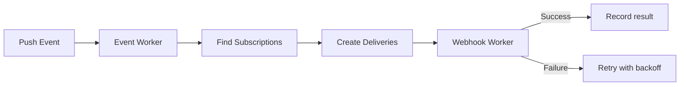

import { Steps } from '@astrojs/starlight/components';

Sparrow accepts webhook registrations and event definitions, fans out events to matching subscribers, and delivers them reliably with retries and health tracking.

## The Full Flow

<Steps>

1. **Register an event type** — tell Sparrow what events exist in your system.

2. **Register a webhook** — provide a URL and the events it should receive. Sparrow creates subscriptions automatically.

3. **Push an event** — when something happens, send the event payload to Sparrow:

    ```bash
    curl -X POST "http://localhost:8080/v1/consumers/default/events?event=order.created" \
      -H "Content-Type: application/json" \
      -d '{
        "payload": {"order_id": "ord_123", "total": 49.99},
        "idempotency_key": "idem_ord_123"
      }'
    ```

4. **Sparrow fans out** — the event worker finds all active subscriptions matching the event name, consumer, and **label filters**, and creates a delivery for each.

5. **Webhook delivery** — the webhook worker renders the subscription's payload transform, if it has one, and sends an HTTP POST to the URL with the body, **Standard Webhooks signatures** (HMAC and/or Ed25519), and Sparrow headers. Failed deliveries are retried with exponential backoff.

6. **Track results** — query delivery status, health metrics, and error categories through the API or the web UI.

</Steps>



## Core Concepts

### Events

An **event** represents something that happened in your system — `order.created`, `user.signed_up`, `payment.failed`, etc. Event types can be registered explicitly, which lets you attach a description and a JSON Schema:

```bash
curl -X POST http://localhost:8080/v1/event-types \
  -H "Content-Type: application/json" \
  -d '{"name": "order.created", "description": "Fires when a new order is placed", "active": true}'
```

Event registrations act as a versioned schema registry. Pushing an unregistered event type returns `404` (set `SPARROW_AUTO_REGISTER_EVENTS=true` in development to create it on first push); pushing an event type that was deactivated is rejected. Changing a type's schema creates a new version and keeps the old one, and event types are never deleted. See [Event Type Versions](/sparrow/guides/event-type-versioning/) and, to promote definitions between environments, [Moving Event Types Between Environments](/sparrow/guides/event-type-export-import/).

### Webhooks

A **webhook** is a registered HTTP endpoint that receives event notifications. When you register a webhook, you provide its URL; Sparrow generates the signing secret and returns it as `http_config.webhook_secret`, in full only in the registration response, so save it then:

```bash
curl -X POST http://localhost:8080/v1/consumers/default/webhooks \
  -H "Content-Type: application/json" \
  -d '{
    "url": "https://your-app.com/webhooks",
    "events": ["order.created"],
    "active": true
  }'
```

When you include `events` during registration, Sparrow automatically creates subscriptions linking that webhook to those event types.

### Subscriptions

A **subscription** connects a webhook to an event type. It controls which events a webhook receives and can optionally transform the payload using Go templates.

Subscriptions are created automatically when you register a webhook with `events`, but you can also manage them explicitly:

```bash
curl -X POST http://localhost:8080/v1/consumers/default/subscriptions \
  -H "Content-Type: application/json" \
  -d '{
    "webhook_id": "YOUR_WEBHOOK_ID",
    "event_name": "order.created"
  }'
```

You can enable payload transforms on a subscription to reshape the event payload before delivery — useful for adapting events to third-party formats like Slack or PagerDuty.

### Deliveries

A **delivery** is a single attempt (or series of retry attempts) to send an event payload to a webhook URL. Sparrow tracks every delivery with:

- HTTP status code and response body
- Response time
- Error classification (timeout, DNS, TLS, connection refused, etc.)
- Retry count and next attempt time

## Key Design Decisions

- **Async by default** — the push-event endpoint (`POST /v1/consumers/{consumer}/events`) returns immediately. Processing and delivery happen in background workers via a persistent job queue (River).
- **At-least-once delivery** — retryable failures (server errors, timeouts, connection issues, `429` rate limiting) are automatically retried. Non-retryable failures (DNS errors, TLS errors, other 4xx responses, template errors) are recorded and not retried. A receiver can see the same delivery twice, so deduplicate on the `webhook-id` header or `event_id`.
- **Per-webhook health tracking** — Sparrow monitors consecutive failures, success rates, and response times for each webhook independently, with a state machine (healthy → degraded → unhealthy). A receiver that keeps failing for days (default 5) is [auto-disabled](/sparrow/guides/webhook-health-alerts/#automatic-disabling).
- **Pauses hold, never drop** — while a webhook or subscription is paused (or auto-disabled), its deliveries are recorded as `paused`; after resuming you retry exactly what was held.
- **Cryptographic signing** — every delivery is signed in the [Standard Webhooks](https://www.standardwebhooks.com/) format: HMAC-SHA256 by default, or Ed25519 per webhook (Ed25519 webhooks carry both signatures, so consumers verify with a shared secret or a public key).
- **Error classification** — every failed attempt gets a [category](/sparrow/reference/error-classification/) (DNS, TLS, timeout, connection refused, rate limited, client error, server error, template error, and so on) that decides whether it's retried, so you know *why* a delivery failed.
- **PostgreSQL only** — no Redis, no message broker. The River job queue runs inside PostgreSQL, keeping the operational footprint to a single database.
- **Consumers** — webhooks and events are organized into consumers for logical separation (e.g., `billing`, `notifications`). A `default` consumer is always available. `_sparrow` is reserved for Sparrow's own `sparrow.*` system events, and only those can be subscribed there (see [Webhook Health Alerts](/sparrow/guides/webhook-health-alerts/)).
- **Soft schema validation** — event schemas produce warnings, not errors. Events are always accepted and stored, with a `schema_valid` flag for filtering.

## Example: one event, two receivers

A shop pushes `order.created` once. The billing service needs the full event;
the sales team wants a line in Slack.

<Steps>

1. Register the billing service as a webhook with `"events": ["order.created"]`.
   It receives the standard envelope and verifies it with its own secret.

2. Apply the Slack recipe for the same event:

    ```bash
    sparrow use slack \
      --param webhook_url=https://hooks.slack.com/services/T000/B000/XXX \
      --event order.created
    ```

    That's a second webhook whose subscription has a transform template, so
    Slack receives a Block Kit message instead of the envelope.

3. Push the event once. Sparrow creates two deliveries, signs, sends and
   retries each one independently, and records both. If Slack is down, billing
   isn't held up, and the Slack delivery is retried on its own.

</Steps>
