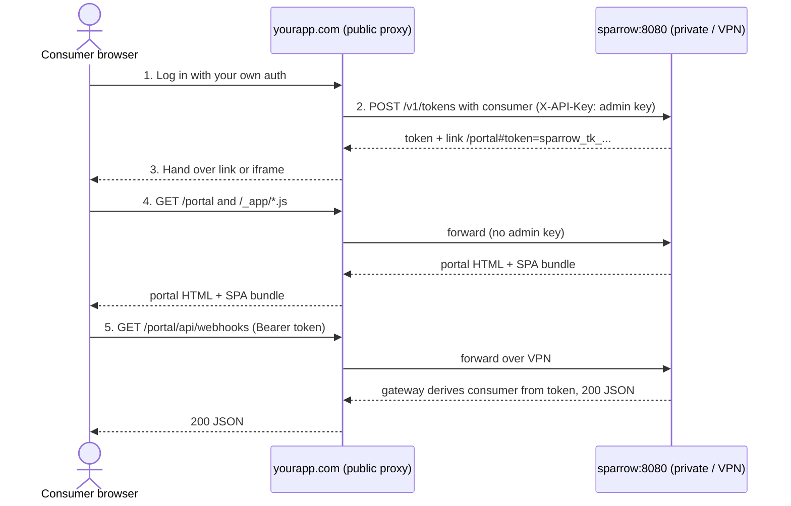
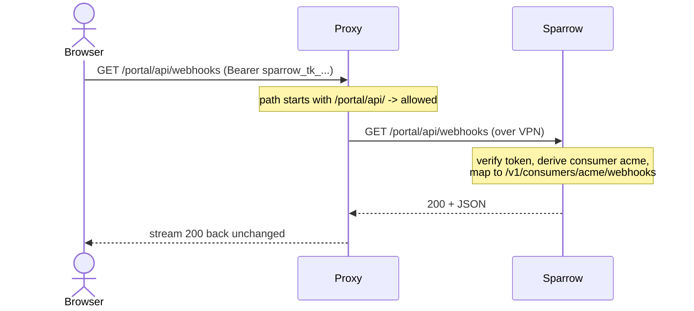

Sparrow's consumer portal (`/portal`) lets each consumer manage their own
webhooks, subscriptions, and deliveries with a scoped, expiring **portal
token** instead of the admin API key. This guide shows the recommended way to
serve it to **external users while Sparrow itself stays VPN-only**: your
product's public app acts as a forwarding proxy for exactly the routes the
portal needs — nothing else.

The result: the visitor's browser only ever talks to *your* domain, Sparrow
is never directly reachable from the internet, and the only credential in the
browser is a token that can touch one consumer and nothing more.

## How it works, end to end



1. **Your app authenticates the user** with whatever login it already has.
   Sparrow plays no part in identity — it never needs user accounts.
2. **Your backend mints a token** over the private network:

   ```bash
   curl -s -X POST http://sparrow:8080/v1/tokens \
     -H "X-API-Key: $SPARROW_API_KEY" -H "Content-Type: application/json" \
     -d '{"name": "portal", "consumer": "acme", "ttl_seconds": 3600, "external_id": "user-42"}'
   # → { "token": { "id": "tok_...", "expires_at": "...", ... }, "secret": "sparrow_tk_...",
   #     "reused": false, "portal_path": "/portal#token=sparrow_tk_...&consumer=acme&expires=..." }
   ```

   This is the **only** call that uses the admin key, and it happens
   server-to-server — the key never crosses the network boundary. The link
   is a consumer-scoped access token (the same kind `sparrow tokens create
   --consumer` makes): pick a short `ttl_seconds` (the default is 7 days),
   and revoke it early with `DELETE /v1/tokens/{id}`.
   `external_id` is your id for who the link is for (your user id, say).
   There is at most one active token per consumer and `external_id`, which
   makes the call safe to repeat on every page view: while that user's link
   is valid, Sparrow returns the same token (`"reused": true`) instead of
   minting another, and mints a fresh one once it has expired or been
   revoked.
3. **Your app hands the link to the browser** — redirect to
   `https://yourapp.com/portal#token=...`, or render it in an `<iframe>`
   (the portal's headers permit framing; the rest of Sparrow forbids it).
   The token rides in the URL *fragment*, which browsers never send in HTTP
   requests — it stays out of your proxy's and Sparrow's access logs.
4. **The browser loads the portal through your proxy.** The HTML and JS
   bundle come from Sparrow via the forwarded routes. Portal HTML is served
   *without* the admin API key (neither the portal nor the dashboard receives it).
5. **The portal calls the API through the same proxy**, under the single
   `/portal/api/` prefix, sending `Authorization: Bearer <token>` on every
   request. Sparrow's portal gateway looks the token up (by its SHA-256 hash,
   cached for 30 seconds), checks it is active, derives the consumer *from
   the token* (never the URL), and
   maps `/portal/api/<rest>` to that consumer's real route — so cross-consumer
   access is structurally impossible, and event injection and token minting
   are refused. No token, bad token, or a denied action is a 401/403.

## What "forwarding" actually means

The proxy is not copying files or caching pages — it is an ordinary program
(nginx, Caddy, or your own backend) that sits on a machine with a foot in
**both** networks: the internet can reach it, and it can reach Sparrow over
the VPN/private network. For every incoming request it does four things:

1. **Match the path** against the allowlist below. No match → respond 404
   itself; Sparrow is never contacted.
2. **Open its own connection** to `sparrow:8080` over the private network.
3. **Replay the request** — same method, same path, same headers (including
   the `Authorization: Bearer` token), same body.
4. **Stream Sparrow's response back** to the browser unchanged.

Trace one real request through it:



The browser never learns Sparrow's address, never joins the VPN, and never
holds anything but the scoped token. To the browser the portal simply *is*
`hooks.yourapp.com`. And because HTML, JS, and API all arrive from that one
origin, no CORS configuration is needed anywhere.

### Prerequisites

- A machine (or container) that is publicly reachable **and** can open TCP
  connections to Sparrow on the private network — typically your existing
  app server or ingress, since it already sits in both worlds.
- A DNS name for it (`hooks.yourapp.com`) with a TLS certificate — Caddy
  below provisions one automatically.
- Sparrow reachable from that machine as `sparrow:8080` (substitute your
  real host/IP), with `SPARROW_API_KEY`, `SPARROW_ENCRYPTION_KEYS`, and
  `SPARROW_ENCRYPTION_PRIMARY_KEY_ID` set.
- `SPARROW_SERVE_UI=true` on a server built with the UI (the Docker image, or
  `make build-with-ui`). Without it `/portal` and `/_app/*` return 404 and only
  `/portal/api/*` works.

## The route allowlist

Forward exactly these routes (three required, the favicon optional), deny everything else:

| Route | Why the portal needs it |
|---|---|
| `GET /portal` | the portal page itself |
| `GET /_app/*` | SPA JS/CSS bundle |
| `* /portal/api/*` | **every** portal API call — webhooks, subscriptions, deliveries, retries, and the read-only catalog/template helpers, all bearer-scoped to the token's consumer |
| `GET /favicon.png` | tab icon (optional) |

That single `/portal/api/*` prefix replaces every per-consumer and per-helper
`/v1` rule. You need **no deny rules**: the portal gateway derives the consumer
from the token, and refuses event injection itself. Token minting
(`POST /v1/tokens`), event injection, the
admin dashboard (`/`), the global `/v1` API, `/docs`, and `/openapi.*` are
simply never forwarded, so they stay unreachable from the internet.

Paths must be preserved **verbatim**: the portal page, its API prefix, and its
assets are root-absolute (`/portal`, `/portal/api`, `/_app`), so the portal
cannot be remounted under `/integrations/webhooks/`. If those roots collide
with your app's own routes, put the proxy on a dedicated subdomain
(`hooks.yourapp.com`).

## Example: Caddy (simplest — start here)

[Caddy](https://caddyserver.com) provisions the TLS certificate itself, so
the entire public vhost is one `Caddyfile` block:

```text
hooks.yourapp.com {
	# No deny rules needed — the portal gateway scopes and refuses on its own.
	@portal path /portal /portal/api/* /_app/* /favicon.png
	reverse_proxy @portal sparrow:8080

	respond 404   # everything else
}
```

Run `caddy run --config Caddyfile` on the dual-homed machine and the portal
is live at `https://hooks.yourapp.com/portal#token=...`.

## Example: nginx

```nginx
# hooks.yourapp.com — public vhost, forwards only the portal slice.
# Rate-limit the API slice (Sparrow does not rate-limit itself).
# limit_req_zone is only allowed in the http {} context.
limit_req_zone $binary_remote_addr zone=portal:10m rate=20r/s;

server {
    listen 443 ssl;
    server_name hooks.yourapp.com;
    # ... ssl_certificate, etc.

    location = /portal          { proxy_pass http://sparrow:8080; }
    location /_app/             { proxy_pass http://sparrow:8080; }
    location = /favicon.png     { proxy_pass http://sparrow:8080; }

    # Every portal API call, bearer-scoped by the gateway. No deny rules
    # needed — the gateway refuses minting/injection and cross-consumer itself.
    location /portal/api/ {
        limit_req zone=portal burst=40 nodelay;
        proxy_pass http://sparrow:8080;
    }

    location / { return 404; }
}
```

Never add `proxy_set_header X-API-Key ...` in this vhost — a valid admin key
outranks portal token scoping, so injecting it would silently make every
portal visitor an admin.

## Example: Express (your app's backend as the proxy)

If you'd rather not run a separate vhost, a few lines in your existing Node
backend do the same job:

```js
import { createProxyMiddleware } from "http-proxy-middleware";

const SPARROW = "http://sparrow:8080"; // reachable over the VPN only

const portalSlice = ["/portal", "/portal/api", "/_app", "/favicon.png"];

// No deny middleware needed: the gateway derives the consumer from the token
// and refuses minting, event injection, and cross-consumer access itself.
app.use(portalSlice, createProxyMiddleware({ target: SPARROW, changeOrigin: true }));

// Minting stays server-side, behind YOUR auth:
app.post("/api/webhook-portal-link", requireLogin, async (req, res) => {
  const consumer = req.user.tenantId; // however you map users → consumers
  const r = await fetch(`${SPARROW}/v1/tokens`, {
    method: "POST",
    headers: { "X-API-Key": process.env.SPARROW_API_KEY, "Content-Type": "application/json" },
    // external_id: the same user gets the same link back while it is valid.
    body: JSON.stringify({ name: "portal", consumer, ttl_seconds: 3600, external_id: req.user.id }),
  });
  const { portal_path } = await r.json();
  res.json({ url: portal_path }); // same-origin: /portal#token=...
});
```

Then link or iframe `url` from your UI. Because everything is same-origin,
no `CORS_ALLOWED_ORIGINS` configuration is needed.

## Security analysis

What each party can and cannot do:

| Actor | Can | Cannot |
|---|---|---|
| Portal visitor with a valid token for `acme` | Manage `acme`'s webhooks/subscriptions, view and retry `acme`'s deliveries | Read any other consumer, inject events, mint tokens, reach the admin UI/API |
| Anyone hitting the public vhost without a token | Load the portal shell (renders "missing access link") | Call any API route — everything under `/portal/api` returns 401 |
| Someone who steals a portal link | Everything the legitimate holder can, until it expires or you revoke it | Escalate beyond that consumer |
| Your backend | Mint tokens for any consumer (it holds the admin key) | — (it is fully trusted; keep the key server-side) |

Why the pieces hold:

- **Token integrity** — a portal token is 256 random bits; Sparrow stores
  only its SHA-256 hash, together with the consumer and expiry. The
  `consumer` and `expires` in the link fragment are for display only —
  editing them changes nothing the server enforces.
- **Scope is enforced by Sparrow, not the proxy.** The consumer comes from
  the stored token, never the URL, so the portal gateway maps every
  `/portal/api` call to that consumer's own route and refuses minting and
  event injection — the proxy needs no deny rules and cross-consumer access
  is impossible even if the whole prefix is forwarded.
- **No admin key in the browser, ever.** The server never writes
  `SPARROW_API_KEY` into any served page (portal or dashboard), and the
  mint call is server-to-server. The single fatal misconfiguration is a
  proxy that injects `X-API-Key` on forwarded portal routes -- never do
  that.
- **Fragment tokens don't leak into logs.** `#token=...` is never sent in
  HTTP requests; the portal moves it to `sessionStorage` and sends it only
  as an `Authorization` header over TLS.
- **Blast radius of a leaked link is bounded** by consumer + TTL, and you
  can cut it short: revoke the link's token id and it stops working
  within 30 seconds on every instance. With `external_id`, each of your
  users holds at most one live link per consumer; expired and revoked links
  are deleted from the database a week later by a daily purge.
- **Reusable links are stored encrypted.** To hand the same link back,
  Sparrow keeps the secret of a token minted with an `external_id`,
  envelope-encrypted with `SPARROW_ENCRYPTION_KEYS` like webhook secrets.
  Tokens minted without one are stored as a SHA-256 hash only. Revoking a
  token deletes its stored secret.

Checklist before going live:

- [ ] `SPARROW_API_KEY` set — with an empty key Sparrow's auth middleware is
      disabled and the forwarded slice would be wide open.
- [ ] `SPARROW_ENCRYPTION_KEYS` and `SPARROW_ENCRYPTION_PRIMARY_KEY_ID` configured and stored in a
      secret manager.
- [ ] `SPARROW_SERVE_UI=true`, so `/portal` is served.
- [ ] Proxy forwards **only** the allowlist; default route denies.
- [ ] No `X-API-Key` injection anywhere on the public vhost.
- [ ] Short `ttl_seconds` (e.g. 3600; the default is 7 days), minted behind your
      login with `external_id` set to your user id; revoke a link's
      token when the user logs out or loses access.
- [ ] TLS terminated at the proxy; rate limiting on `/portal/api/`.
## Alternative: no Sparrow UI at all

If you want full brand control, skip the portal UI and build your own
screens: your backend keeps the token (or admin key) server-side, calls the
consumer-scoped REST API over the VPN, and renders native components. The
[OpenAPI spec](/sparrow/reference/api) and generated clients make this
mechanical — the portal is a convenience, the API is the contract.
