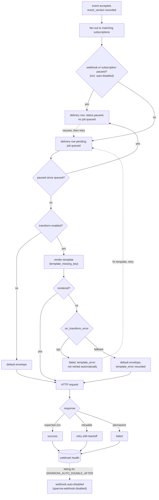

import { Aside } from '@astrojs/starlight/components';

Pause a subscription when its deliveries should stop for a while: the
receiving system is under maintenance, its template is being fixed after a
schema change, or you are investigating something. Nothing is lost.

## What a pause does

- Events keep fanning out to the subscription. Each delivery is recorded with
  status **paused**, and nothing is queued or attempted.
- Deliveries that were already queued or retrying when you paused are held
  too: their next attempt becomes **paused** instead of being sent.
- Other subscriptions on the same webhook are unaffected. Pausing the whole
  webhook, by hand or when Sparrow
  [auto-disables it](/sparrow/guides/webhook-health-alerts/#automatic-disabling),
  works the same way for all of its subscriptions: deliveries are held as
  paused, and resuming the webhook reports how many
  (`paused_deliveries`) so you can retry them with
  `status=paused&webhook_id={webhook_id}`.
- A pause is not a failure of the receiving system, so it **never affects the
  webhook's health** or raises health alerts.

```bash
curl -X POST http://localhost:8080/v1/consumers/acme/subscriptions/{subscription_id}:pause \
  -H 'Content-Type: application/json' \
  -d '{"reason": "receiver maintenance until Friday"}'
```

The subscription then shows `paused: true`, `paused_at` and `paused_reason`.
Pausing again updates the reason and keeps the original time. In the UI, use
**Pause** on the subscription; its card shows the reason while it is paused.

## Seeing what was held

Held deliveries are ordinary deliveries with status **paused**:

- The delivery lists (all deliveries, or one webhook's) show them with a
  **Paused** badge, and the status filter has a **Paused** option
  (`GET /v1/consumers/{consumer}/deliveries?status=paused`).
- Each one records why it was held in `error_message`, shown on the delivery
  page: `Held: subscription is paused (<your reason>)`,
  `Held: webhook is paused`, or `Held: webhook was auto-disabled`.
- A delivery that was already retrying when the pause began keeps the error
  of its last failed attempt alongside the hold.
- The event itself appears in the event history as usual, with its paused
  deliveries listed under it.

## Resuming

```bash
curl -X POST http://localhost:8080/v1/consumers/acme/subscriptions/{subscription_id}:resume
```

New deliveries are attempted again straight away. **Deliveries held during the
pause are not sent automatically**: you decide what to replay. The response
tells you how many there are and when the pause began:

```json
{ "subscription_id": "…", "paused": false, "paused_since": "2026-09-30T10:00:00Z", "paused_deliveries": 42 }
```

To send them, snapshot them with the delivery list and start a batch retry.
The list returns the snapshot as `retry_id`; the batch retry endpoint takes
that same value in a field called `repush_id` (both endpoints share one
snapshot format):

```bash
curl "http://localhost:8080/v1/consumers/acme/deliveries?status=paused&subscription_id={subscription_id}&created_after=2026-09-30T10:00:00Z&prepare_retry=true"
# -> {"items": [...], "retry_id": "3f2a9c1e-…", ...}

curl -X POST http://localhost:8080/v1/consumers/acme/deliveries:retryBatch \
  -H 'Content-Type: application/json' -d '{"repush_id": "3f2a9c1e-…"}'
```

The retry runs in the background. The response is the job, whose `id` is that
same snapshot ID; follow its `status`, `processed` and `failed` counts with
`GET /v1/consumers/acme/retry-jobs/3f2a9c1e-…`.

Narrow `created_after` (or add `created_before`) to replay only part of the
window. In the UI, resuming a subscription that held deliveries offers
**Retry paused deliveries**.

<Aside type="note" title="How long held deliveries last">
A paused delivery is kept until it is retried, or until
`SPARROW_EVENT_RETENTION_DAYS` removes its event. Like any manual retry,
retrying a paused delivery sends it even if the event's TTL has passed.
</Aside>

## Pausing from an import

When importing event types, `--pause-affected` (API:
`subscription_policy: "pause"`) pauses every subscription whose template fails
against the new schema, in the same transaction, with the import as the
reason. See [Moving Event Types Between Environments](/sparrow/guides/event-type-export-import/#subscriptions-whose-template-fails).

## Where pause fits in a delivery



Only the receiving system's responses count toward the webhook's health.
Paused deliveries and template errors never do.
